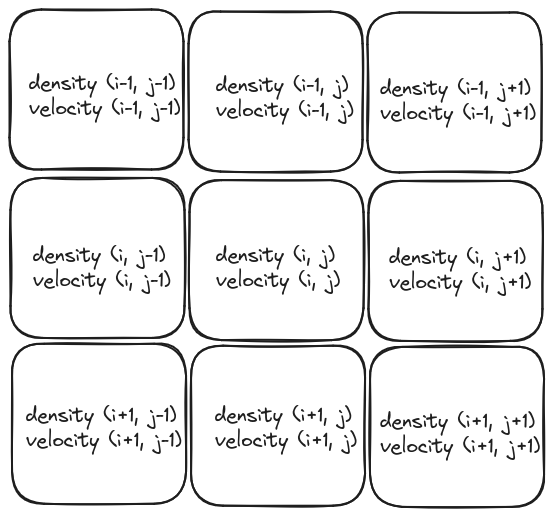
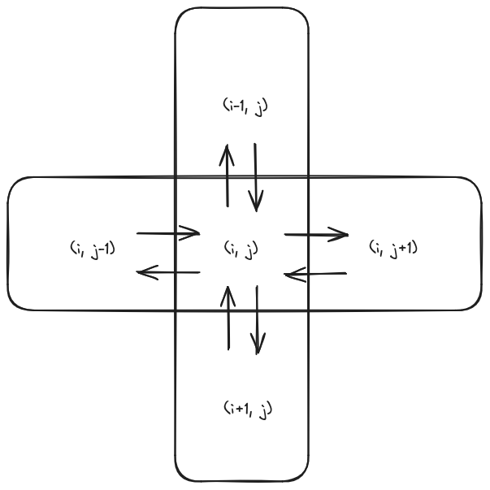

# Simulating fluid

The following article is an implementation and a summarization of this paper:

[Real-Time Fluid Dynamics for Games](http://graphics.cs.cmu.edu/nsp/course/15-464/Fall09/papers/StamFluidforGames.pdf)

Link to source code on github : [Simulating Smoke Source Code](https://github.com/smdaa/creative-coding/blob/main/src/example_2)


## Content
<!-- toc -->

## Theoretical background
The Navier-Stokes equations serve as a precise mathematical framework for describing fluid flows found in nature, yet solving them can be quite challenging. Analytical solutions are only feasible in very basic scenarios. In practical applications, the priority is to ensure that simulations are both visually convincing and computationally efficient.

The Navier-Stokes Equations are expressed as follows:
$$
\frac{\partial \vec{u}}{\partial t} = - (\vec{u} . \nabla) \vec{u} + \nu \nabla ^ 2 \vec{u} + \vec{f}
$$
$$
\frac{\partial \rho}{\partial t} = -(\vec{u} . \nabla) \rho + \kappa \nabla ^ 2 \rho + s
$$
where
- \\(\vec{u}\\) represents the vector field of the fluid, meaning for each point in space we have a velocity vector.
- \\(\frac{\partial \vec{u}}{\partial t}\\) represents the rate of change of velocity with respect to time. In other words, it describes how the velocity field \\(\vec{u}\\) changes over time at each point in space.
- \\(- (\vec{u} \cdot \nabla) \vec{u}\\) denotes the convective acceleration term. It accounts for how the velocity field "advects" itself, meaning how the velocity field carries and transports fluid particles along its path.

To understand why \\(- (\vec{u} \cdot \nabla) \vec{u}\\) is a vector, consider its expansion:
       $$
       - (\vec{u} \cdot \nabla) \vec{u} = - \left(u \frac{\partial}{\partial x} + v \frac{\partial}{\partial y} + w \frac{\partial}{\partial z}\right)\vec{u}
       $$
       Here, \\(\vec{u} = (u, v, w)\\) represents the velocity field in three dimensions.
       When we apply the operator \\(- \left(u \frac{\partial}{\partial x} + v \frac{\partial}{\partial y} + w \frac{\partial}{\partial z}\right)\\) to \\(\vec{u}\\) we're essentially taking the derivative of each component of \\(\vec{u}\\) with respect to its corresponding spatial coordinate (\\(x\\), \\(y\\), or \\(z\\)) and then multiplying them by the components of \\(\vec{u}\\).
       Each resulting scalar expression, when taken together, forms a vector. Therefore, \\(- (\vec{u} \cdot \nabla) \vec{u}\\) represents a vector field, as it consists of three scalar components which, when combined, create a vector.
- \\(\nu \nabla ^ 2 \vec{u}\\) is the viscous diffusion term. It represents the dissipation of kinetic energy due to viscosity, which tends to smooth out velocity gradients within the fluid.
- \\(\vec{f}\\) represents external forces acting on the fluid, such as gravity or electromagnetic forces.
- \\(\rho\\) is the density field of the fluid,  a continuous function which for every point in space tells us the amount of dust particles present
- \\(\frac{\partial \rho}{\partial t}\\) represents the rate of change of density with respect to time. It describes how the density of the fluid changes over time at each point in space.
- \\(-(\vec{u} \cdot \nabla) \rho\\) is the convective term for density. It describes how the density field is advected by the velocity field.
- \\(\kappa \nabla ^ 2 \rho\\) is the diffusion term for density. Similar to the viscous diffusion term in the velocity equation, it represents the smoothing out of density gradients within the fluid.
- \\(s\\) represents any source or sink terms contributing to changes in density, such as chemical reactions or heat sources.

## Implementation
### Fluid grid
We'll describe the fluid's behavior by discretizing a 2D plane. This involves dividing the space into a grid of cells and measuring fluid properties (velocity and density) at the center of each cell.

<p align="center">
  
</p>

We will define a **FluidGrid** class as follows

```C
class FluidGrid {

public:
  int numRows;
  int numColumns;
  std::vector<std::vector<float>> densityGrid;
  std::vector<std::vector<float>> velocityGridX;
  std::vector<std::vector<float>> velocityGridY;
  std::vector<std::vector<float>> densitySourceGrid;
  std::vector<std::vector<float>> velocitySourceGridX;
  std::vector<std::vector<float>> velocitySourceGridY;

private:
  std::vector<std::vector<float>> densityGridOld;
  std::vector<std::vector<float>> velocityGridXOld;
  std::vector<std::vector<float>> velocityGridYOld;

};
```

**densityGrid**, **velocityGridX**, **velocityGridY** store the current density and velocity values,while **densitySourceGrid**, **velocitySourceGridX**, **velocitySourceGridY** indicate the fluid sources, representing the terms \\(s\\) and \\(\vec{f}\\) in the Navier-Stokes equations. Additionally **densityGridOld**, **velocityGridXOld**, **velocityGridYOld** retain the density and velocity values from the previous calculation.

### Solving for density
Initially, we'll outline the solution method for a density field in motion within a constant velocity field that remains unchanged over time.
Let's consider the density equation:
$$
\frac{\partial \rho}{\partial t} = -(\vec{u} . \nabla) \rho + \kappa \nabla ^ 2 \rho + s
$$

#### Adding source
The first term from the right says that the density increases due to sources, this can be easly implemented with the following function.

```C
void FluidGrid::addSource(int numRows, int numColumns,
                          std::vector<std::vector<float>> &grid,
                          const std::vector<std::vector<float>> &sourceGrid,
                          float timeStep) {
#pragma omp parallel for
  for (int i = 0; i < numRows; ++i) {
    for (int j = 0; j < numColumns; ++j) {
      grid[i][j] += sourceGrid[i][j] * timeStep;
    }
  }
}
```

`#pragma omp parallel for` is a component of [OpenMP](https://www.openmp.org/wp-content/uploads/OpenMPRefGuide-5.2-Web-2024.pdf), a library facilitating parallel programming in C/C++. It's employed before a for loop to distribute its iterations among multiple threads. Consequently, the loop iterations can be executed concurrently, thereby diminishing the overall execution time.

Opting to parallelize the outer loop instead of the inner loop is frequently more effective because it minimizes overhead. Each parallel region, initiated by `#pragma omp parallel`, incurs overhead, such as the creation and destruction of threads.

We can start building out **stepDensity** method:

```C
void FluidGrid::stepDensity(int diffusionFactor, int gaussSeidelIterations,
                            float timeStep) {
  addSource(numRows, numColumns, densityGrid, densitySourceGrid, timeStep);
}
```

#### Diffusion
Diffusion represents the second term in the equation (\\(\kappa \nabla ^ 2 \rho\\)), involving the dispersion of density across the grid cells. We'll assume that each grid cell can only exchange density with its four immediate neighbors.

<p align="center">
  
</p>

Each cell will lose some of its density to it's four neighbors, but will also gain some of the density of each of its neighbors:
$$
\rho_{t + \Delta t}[i, j] - \rho_{t}[i, j] = a  (\rho_{t}[i-1, j] + \rho_{t}[i+1, j] + \rho_{t}[i, j-1] + \rho_{t}[i, j+1] - 4 \rho_{t}[i, j])
$$
Where \\(a\\) is a diffusion factor.
A stable method given by the paper's author that revolves around finding densities which when diffused backward in time yield the densities started with, meaning we will solve for \\((\rho_{t + \Delta t}[i, j])\\) given the equations
$$
\rho_{t}[i, j] = \rho_{t + \Delta t}[i, j] - a (\rho_{t + \Delta t}[i-1, j] + \rho_{t + \Delta t}[i+1, j] + \rho_{t + \Delta t}[i, j-1] + \rho_{t + \Delta t}[i, j+1] - 4 \rho_{t + \Delta t}[i, j])
$$
Let's write the system as a matrix product.
let \\(x_t\\) and \\(x_{t +\Delta t}\\) be
$$
\begin{array}{cc}
x_t = & \begin{pmatrix}
	\rho_{t}[0, 0] \newline
	\rho_{t}[0, 1] \newline
	\vdots \newline
	\rho_{t}[i, j-1] \newline
	\rho_{t}[i, j] \newline
	\rho_{t}[i, j+1] \newline
	\vdots \newline
	\rho_{t}[N, M-1] \newline
	\rho_{t}[N, M] \newline
\end{pmatrix} 
\text{ and} & 
x_{t + \Delta t} = & \begin{pmatrix}
	\rho_{t + \Delta t}[0, 0] \newline
	\rho_{t + \Delta t}[0, 1] \newline
	\vdots \newline
	\rho_{t + \Delta t}[i, j-1] \newline
	\rho_{t + \Delta t}[i, j] \newline
	\rho_{t + \Delta t}[i, j+1] \newline
	\vdots \newline
	\rho_{t + \Delta t}[N, M-1] \newline
	\rho_{t + \Delta t}[N, M] \newline
\end{pmatrix}
\end{array}
$$
We have 
$$
x_t = (I - a A) x_{t + \Delta t}
$$
where 
$$
A_{ij} = 
\begin{cases} 
-4 & \text{if } i = j \newline
1  & \text{if } i \pm 1 = j \text{ or } i = j \pm M \newline
0  & \text{otherwise}
\end{cases}
$$
Since \\((I - aA)\\)  is very sparse, we can use the simplest iterative solver: [Gauss-Seidel relaxation](https://en.wikipedia.org/wiki/Gauss%E2%80%93Seidel_method), at iteration \\(k\\):
$$
\rho_{t + \Delta t}^{k + 1}[i, j] = \frac{1}{1+4a} (\rho_{t}[i, j] + a (\rho^k_{t + \Delta t}[i-1, j] + \rho^k_{t + \Delta t}[i+1, j] + \rho^k_{t + \Delta t}[i, j-1] + \rho_{t + \Delta t}^k[i, j+1]))
$$

Therefore we can define out diffusion function as follows:

```C
void FluidGrid::diffuse(int numRows, int numColumns,
                        std::vector<std::vector<float>> &outGrid,
                        const std::vector<std::vector<float>> &inGrid,
                        int gaussSeidelIterations, float factor, int b,
                        float timeStep) {
  float a = timeStep * factor * numRows * numColumns;
  float denominator = 1 + 4 * a;
  for (int k = 0; k < gaussSeidelIterations; ++k) {
#pragma omp parallel for
    for (int i = 0; i < numRows; ++i) {
      for (int j = 0; j < numColumns; ++j) {
        float sum = 0.0f;
        sum += (i > 0) ? inGrid[i - 1][j] : 0.0f;              // Left
        sum += (i < numRows - 1) ? inGrid[i + 1][j] : 0.0f;    // Right
        sum += (j > 0) ? inGrid[i][j - 1] : 0.0f;              // Up
        sum += (j < numColumns - 1) ? inGrid[i][j + 1] : 0.0f; // Down
        outGrid[i][j] = (inGrid[i][j] + a * sum) / (denominator);
      }
    }
    setBounds(numRows, numColumns, outGrid, b);
  }
}
```

And we can update the **stepDensity** method:

```C
void FluidGrid::stepDensity(int diffusionFactor, int gaussSeidelIterations,
                            float timeStep) {
  addSource(numRows, numColumns, densityGrid, densitySourceGrid, timeStep);
  diffuse(numRows, numColumns, densityGridOld, densityGrid,
          gaussSeidelIterations, diffusionFactor, 0, timeStep);
}
```