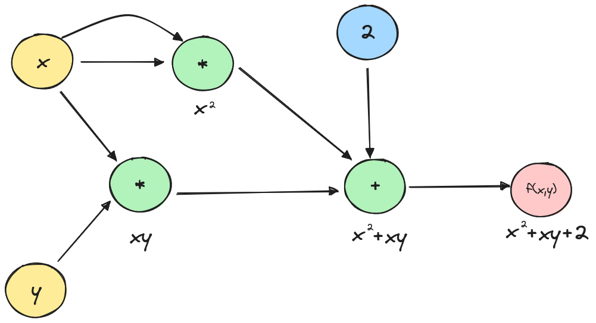
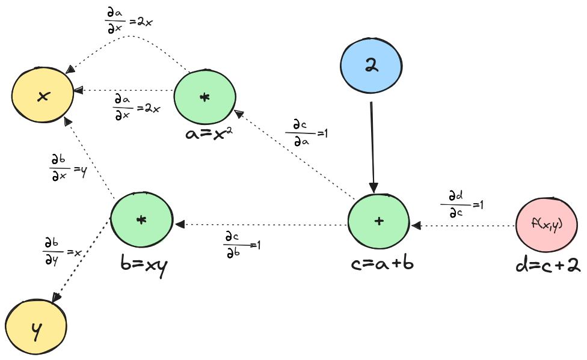
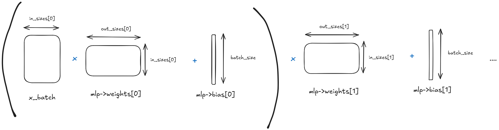

# Building an Autograd Library from Scratch in C for Simple Neural Networks

## Content
<!-- toc -->

## Introduction
Autograd, is a fundamental component in machine learning frameworks, enabling the automatic computation of gradients for training neural networks. This article will walk you through my journey of writing an Autograd library from scratch (no third-party libraries) in pure C.

The source code is hosted in this [repository](https://github.com/smdaa/teeny-autograd-c)

## Neural Networks: A Brief Overview
At its core, a neural network consists of neurons organized in layers. Each neuron receives input from the previous layer, processes it using a weighted sum, applies an activation function, and passes the output to the next layer.

<p align="center">
  
</p>

Mathematically, we can express the output of a single neuron as:
$$
y = f(\sum_{i=1}^{n} w_i x_i + b)
$$

where \\(x_i\\)​ are the inputs, \\(w_i\\)​​ are the weights, \\(b\\) is the bias, and \\(f\\) is the activation function.

A layer is simply a collection of neurons, and neural networks typically consist of three types of layers: input, hidden, and output layers.

<p align="center">
  
</p>

Neural networks learn by adjusting the weights \\(w_i\\) and bias \\(b\\) of each neuron to minimize the error in their predictions. This is done via [gradient descent](https://en.wikipedia.org/wiki/Gradient_descent), where the network computes the gradient of the error for each weight and bias and then updates them in the direction that reduces the error.

## Derivative Calculation: Symbolic, Numerical and Automatic Differentiation
There are three fundamental ways to calculate derivatives:

* **Symbolic differentiation**: It involves finding the exact derivative of a function using algebraic rules. If the function has a known mathematical expression, we can compute its derivative symbolically. For example for \\(f(x) = x^2\\) the derivative is \\(f'(x) = 2x\\). This method can lead to unwieldy expressions, especially for functions involving products, quotients, or compositions of multiple functions.

* **Numerical differentiation**: These methods estimate the derivative by using values of the function at specific points. A common finite difference formula for the first derivative is given by \\(f'(x) = \frac{f(x+h) - f(x)}{h}\\), \\(h\\) is a small step size. However, finite difference methods are not well-suited for neural networks mainly for efficiency reasons: neural networks typically involve a large number of parameters (weights and biases). Calculating the gradient for each parameter using finite differences would require evaluating the function multiple times, leading to a significant computational overhead.

* **Automatic differentiation**: Automatic differentiation works by breaking down a function into basic mathematical components and creating a graph. In this graph, the nodes represent variables and operations, while the edges connect each operation to its input variables.

Let's review a straightforward example of automatic differentiation to make things clearer. Let \\(f\\) be the function \\(f(x, y) = x^2 +xy +2\\), we will try to find the partial derivatives of \\(f\\) with automatic differentiation.

First let's represent the function \\(f\\) as a graph:

<p align="center">
  
</p>

Now that we have broken the function \\(f\\) to the two mathematical operations \\(*\\) and \\(+\\) which we know how to differentiate, let's add the local derivatives to the graph.

<p align="center">
  
</p>

To find the partial derivatives of \\(f\\) we need to find the path from \\(d\\) to \\(x\\) and apply the chain rule. This involves computing the partial derivatives of intermediate variables along this path:

$$
\frac{\partial d}{\partial x} = \frac{\partial d}{\partial c} . \frac{\partial c}{\partial x} = \frac{\partial d}{\partial c} . (\frac{\partial c}{\partial a} . \frac{\partial a}{\partial x} + \frac{\partial c}{\partial b} . \frac{\partial b}{\partial x})
$$

Therefore
$$
\frac{\partial d}{\partial x} = 2x + y
$$

And 
$$
\frac{\partial d}{\partial y} = \frac{\partial d}{\partial c} . \frac{\partial c}{\partial y} = \frac{\partial d}{\partial c} . (\frac{\partial c}{\partial a} . \frac{\partial a}{\partial y} + \frac{\partial c}{\partial b} . \frac{\partial b}{\partial y})
$$

Therefore
$$
\frac{\partial d}{\partial y} = x
$$

Using the graph above, we can easily find the answers by tracing paths from \\(d\\) to \\(x\\) or \\(y\\). Multiply the weights along each path and then sum the results from the different paths.

Therefore, the interest of automatic differentiation is in its ability to efficiently compute gradients for complex functions. It automates the application of the chain rule, ensuring accurate and fast derivatives.

## Implementation
### N-dimensional array
Before we can implement the Autograd library, we need to create an N-dimensional array (ndarray) library.

The C structure for n-dimensional arrays will include the array's dimension, total size, shape (size of each dimension), and a pointer to the data. The data type is configurable via a macro.

```C
#define NDARRAY_TYPE double

typedef struct ndarray {
  int dim;
  int size;
  int *shape;
  NDARRAY_TYPE *data;
} ndarray;
```

Internally, we are representing n-dimensional arrays by a 1D array since it simplifies memory management and access. We can access elements in an n-dimensional array using the shape array. This approach allows us to avoid the need for complex nested loops and makes operations like slicing and reshaping straightforward and performant.

We need functions that operate on the ndarrays, we can distinguish between 3 types of operations:

* **Unary operations**: operations that work on a single ndarray, transforming its elements via element-wise mathematical functions:
```C
ndarray *unary_op_ndarray(ndarray *arr, NDARRAY_TYPE (*op)(NDARRAY_TYPE)) {
  ndarray *n_arr = (ndarray *)malloc(sizeof(ndarray));
  n_arr->dim = arr->dim;
  n_arr->size = arr->size;
  n_arr->shape = (int *)malloc(arr->dim * sizeof(int));
  for (int i = 0; i < arr->dim; i++) {
    n_arr->shape[i] = arr->shape[i];
  }
  n_arr->data = (NDARRAY_TYPE *)malloc(arr->size * sizeof(NDARRAY_TYPE));
  for (int i = 0; i < arr->size; i++) {
    n_arr->data[i] = op(arr->data[i]);
  }

  return n_arr;
}
```
* **Binary operations**: operations that combine two ndarrays element-wise. These include arithmetic operations (addition, subtraction, multiplication, division). We will also support broadcasting, which allows operations on ndarrays of different but compatible shapes, making it possible to add a vector to a matrix for example which adds the vector to each row of the matrix.
```C
ndarray *binary_op_ndarray(ndarray *arr1, ndarray *arr2,
                           NDARRAY_TYPE (*op)(NDARRAY_TYPE, NDARRAY_TYPE)) {
  if (arr1->dim != arr2->dim) {
    printf("Incompatible dimensions");
    return NULL;
  }
  for (int i = 0; i < arr1->dim; i++) {
    if ((arr1->shape[i] != arr2->shape[i]) &&
        (arr1->shape[i] != 1 && arr2->shape[i] != 1)) {
      printf("Incompatible dimensions");
      return NULL;
    }
  }
  int dim = arr1->dim;
  int *shape = (int *)malloc(dim * sizeof(int));
  for (int i = 0; i < dim; i++) {
    int shape1 = arr1->shape[i];
    int shape2 = arr2->shape[i];
    shape[i] = shape1 > shape2 ? shape1 : shape2;
  }
  ndarray *arr = zeros_ndarray(dim, shape);
  free(shape);
  for (int i = 0; i < arr->size; i++) {
    int idx1 = 0, idx2 = 0, temp = i, stride1 = 1, stride2 = 1;
    for (int j = arr->dim - 1; j >= 0; j--) {
      int shape1 = arr1->shape[j];
      int shape2 = arr2->shape[j];
      idx1 += (temp % shape1) * stride1;
      idx2 += (temp % shape2) * stride2;
      stride1 *= shape1;
      stride2 *= shape2;
      temp /= (shape1 > shape2 ? shape1 : shape2);
    }
    arr->data[i] =
        op(arr1->data[idx1 % arr1->size], arr2->data[idx2 % arr2->size]);
  }
  return arr;
}
```
* **Reduce operations**: operations that collapse one or more dimensions of an ndarray, producing a result with fewer dimensions. Examples include sum, mean, max, and min along specified axes. 
```C
static int get_offset(ndarray *arr, const int *position, int pdim) {
  unsigned int offset = 0;
  unsigned int len = arr->size;
  for (int i = 0; i < pdim; i++) {
    len /= arr->shape[i];
    offset += position[i] * len;
  }
  return offset;
}

void reduce_ndarray_helper(ndarray *arr, ndarray *n_arr, int *position,
                           NDARRAY_TYPE (*op)(NDARRAY_TYPE, NDARRAY_TYPE),
                           int axis, int dim) {
  if (dim >= arr->dim) {
    int rdim = n_arr->dim;
    int n_position[rdim];
    for (int i = 0; i < rdim; i++) {
      n_position[i] = (i == axis) ? 0 : position[i];
    }
    int offset_arr = get_offset(arr, position, arr->dim);
    int offset_narr = get_offset(n_arr, n_position, n_arr->dim);
    n_arr->data[offset_narr] =
        (dim == axis) ? arr->data[offset_arr]
                      : op(n_arr->data[offset_narr], arr->data[offset_arr]);

    return;
  }
  for (int i = 0; i < arr->shape[dim]; i++) {
    position[dim] = i;
    reduce_ndarray_helper(arr, n_arr, position, op, axis, dim + 1);
  }
}

ndarray *reduce_ndarray(ndarray *arr,
                        NDARRAY_TYPE (*op)(NDARRAY_TYPE, NDARRAY_TYPE),
                        int axis, NDARRAY_TYPE initial_value) {
  int *shape = (int *)malloc(arr->dim * sizeof(int));
  for (int i = 0; i < arr->dim; i++) {
    shape[i] = (i == axis) ? 1 : arr->shape[i];
  }
  ndarray *n_arr = full_ndarray(arr->dim, shape, initial_value);
  free(shape);
  int position[arr->dim];
  reduce_ndarray_helper(arr, n_arr, position, op, axis, 0);

  return n_arr;
}
```
For more info check [ndarray.c](https://github.com/smdaa/teeny-autograd-c/blob/main/src/ndarray.c)
<!---
### Variable node ([variable.h](https://github.com/smdaa/teeny-autograd-c/blob/main/src/variable.h))

Let us now implement the mechanism that will make it possible to use Autograd. We will define a variable structure wich represents a node in the Autograd graph:

```C
typedef struct variable {
  ndarray *val;
  ndarray *grad;
  struct variable **children;
  int n_children;
  void (*backward)(struct variable *);
  int ref_count;
} variable;
```

* `ndarray *val` : This pointer holds the actual value of the variable stored as a ndarray.
* `ndarray *grad` : This pointer stores the gradient of the variable, which is essential for backpropagation.
* `struct variable **children` : A pointer to an array of pointers to other variables. These represent the variables that depend on this one in the computational graph.
* `int n_children` : The number of child variables, used to keep track of the size of the children array.
* `void (*backward)(struct variable *)` : A function pointer to the backward operation for this variable. This function will be called during backpropagation to compute gradients.
* `int ref_count` : A reference counter for memory management, useful for determining when the variable can be safely deallocated.

Now that we have defined the basic node in the graph, we will define operations on variables (function names are self explanatory):

```C
variable *add_variable(variable *var1, variable *var2);
variable *subtract_variable(variable *var1, variable *var2);
variable *multiply_variable(variable *var1, variable *var2);
variable *divide_variable(variable *var1, variable *var2);
variable *power_variable(variable *var1, variable *var2);
variable *negate_variable(variable *var);
variable *exp_variable(variable *var);
variable *log_variable(variable *var);
variable *sum_variable(variable *var, int axis);
variable *relu_variable(variable *var);
variable *sigmoid_variable(variable *var);
variable *softmax_variable(variable *var, int axis);
variable *tanh_variable(variable *var);
variable *matmul_variable(variable *var1, variable *var2);
```

Let's took a deeper look into `add_variable` as an example. This function creates a new variable in the computational graph which is the sum of `var1` and `var2`:

```C
variable *add_variable(variable *var1, variable *var2) {
  variable *var = (variable *)malloc(sizeof(variable));
  var->val = add_ndarray_ndarray(var1->val, var2->val);
  var->grad = zeros_ndarray(var->val->dim, var->val->shape);
  var->children = (variable **)malloc(2 * sizeof(variable *));
  var->children[0] = var1;
  var->children[1] = var2;
  var->n_children = 2;
  var->backward = add_backward;
  var->ref_count = 0;
  var1->ref_count++;
  var2->ref_count++;

  return var;
}
```
The `add_variable` function creates a new variable representing the sum of two input variables. It:

1. Allocates memory for the new variable.
2. Computes its value by adding the input values.
3. Initializes its gradient to zeros.
4. Sets up links to its parent variables.
5. Assigns the appropriate backward function.
6. Manages reference counting for memory safety.

The `add_backward` function is responsible for computing and propagating the gradients back to the input variables (var1 and var2) of the add_variable:

```C
void add_backward(variable *var) {
  ndarray *place_holder;
  ndarray *reduced_grad;
  ndarray *temp;

  place_holder = var->children[0]->grad;
  reduced_grad = copy_ndarray(var->grad);
  for (int i = 0; i < var->children[0]->val->dim; i++) {
    if (var->children[0]->val->shape[i] != var->grad->shape[i]) {
      temp = sum_ndarray(reduced_grad, i);
      free_ndarray(&reduced_grad);
      reduced_grad = temp;
    }
  }
  var->children[0]->grad =
      add_ndarray_ndarray(reduced_grad, var->children[0]->grad);
  free_ndarray(&place_holder);
  free_ndarray(&reduced_grad);

  place_holder = var->children[1]->grad;
  reduced_grad = copy_ndarray(var->grad);
  for (int i = 0; i < var->children[1]->val->dim; i++) {
    if (var->children[1]->val->shape[i] != var->grad->shape[i]) {
      temp = sum_ndarray(reduced_grad, i);
      free_ndarray(&reduced_grad);
      reduced_grad = temp;
    }
  }
  var->children[1]->grad =
      add_ndarray_ndarray(reduced_grad, var->children[1]->grad);
  free_ndarray(&place_holder);
  free_ndarray(&reduced_grad);
}
```
Here is a step-by-step explanation of what each part of the function does:

At first we handle the first child, we loop over each dimension of the child's value. If the dimension of the child's value does not match the dimension of the current variable's gradient, the gradient is summed along that dimension using the `sum_ndarray` function. This is necessary to ensure the dimensions align properly for gradient addition:

```C
place_holder = var->children[0]->grad;
reduced_grad = copy_ndarray(var->grad);
for (int i = 0; i < var->children[0]->val->dim; i++) {
  if (var->children[0]->val->shape[i] != var->grad->shape[i]) {
    temp = sum_ndarray(reduced_grad, i);
    free_ndarray(&reduced_grad);
    reduced_grad = temp;
  }
}
```

Then the gradient of the first child is updated by adding the adjusted gradient (reduced_grad) to the existing gradient. Memory used for temporary variables is then freed.

```C
var->children[0]->grad =
      add_ndarray_ndarray(reduced_grad, var->children[0]->grad);
free_ndarray(&place_holder);
free_ndarray(&reduced_grad);
```
The function then does the same for the second child.

For more info check [variable.c](https://github.com/smdaa/teeny-autograd-c/blob/main/src/variable.c)

### Multilayer perceptron ([multilayer_perceptron.h](https://github.com/smdaa/teeny-autograd-c/blob/main/src/multilayer_perceptron.h))

Now that we have defined the variable structure, we have all we need to implement a Multilayer Perceptron (MLP), also known as a feedforward neural network.

```C
typedef struct multilayer_perceptron {
  int n_layers;
  int batch_size;
  int *in_sizes;
  int *out_sizes;
  variable **weights;
  variable **bias;
  variable **weights_copy;
  variable **bias_copy;
  activation_function *activations;
  random_initialisation *random_initialisations;

} multilayer_perceptron;
```
The `multilayer_perceptron` struct is designed to represent a neural network model with multiple layers. Here's a breakdown of its components:

* `n_layers`: The number of layers in the MLP, excluding the input layer.
* `batch_size`: The size of the input data batches the MLP processes at once.
* `in_sizes`: An array containing the input sizes for each layer.
* `out_sizes`: An array containing the output sizes for each layer.
* `weights`: An array of pointers to variable structs representing the weight matrices for each layer.
* `bias`: An array of pointers to variable structs representing the bias vectors for each layer.
* `weights_copy`: Copies of the weight matrices, used for optimization purposes.
* `bias_copy`: Copies of the bias vectors, used for optimization purposes.
* `activations`: An array specifying the activation function used for each layer:
```C
typedef enum {
  LINEAR,
  RELU,
  SIGMOID,
  SOFTMAX,
  TANH,
} activation_function;
```
* `random_initialisations`: An array specifying the random initialization method for the weights of each layer:
```C
typedef enum {
  UNIFORM,
  NORMAL,
  TRUNCATED_NORMAL,
} random_initialisation;
```

#### The forward pass
The forward pass is simple: We first multiply the batched data by the weights, then add the bias, and finally apply the activation function for each layer.

<p align="center">
  
</p>

-->