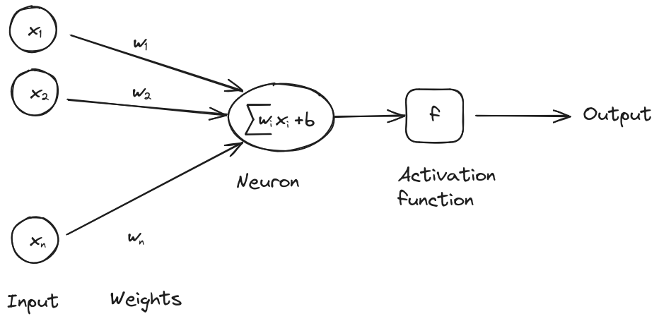
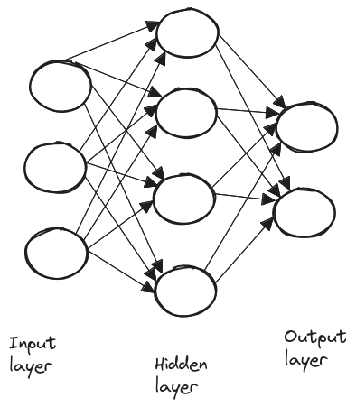
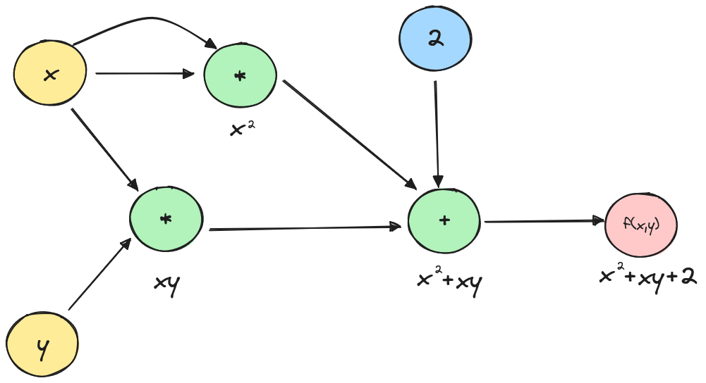
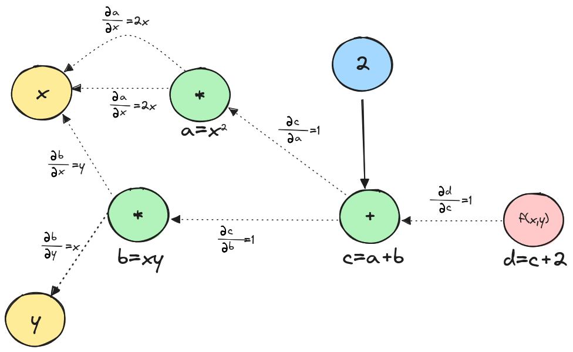

# Building an Autograd Library from Scratch in C for Simple Neural Networks

## Content
<!-- toc -->

## Introduction
Autograd, short for automatic differentiation, is a fundamental component in machine learning frameworks, enabling the automatic computation of gradients that are used for training neural networks. This article will walk you through my journey of writing an autograd library from scratch in pure C.

The source code is hosted in this [repository](https://github.com/smdaa/teeny-autograd-c)

## Neural Networks: A Brief Overview
At its core, a neural network consists of neurons organized in layers. Each neuron receives input from the previous layer, processes it using a weighted sum, applies an activation function, and passes the output to the next layer.

  

Mathematically, we can express the output of a single neuron as:
$$
y = f(\sum_{i=1}^{n} w_i x_i + b)
$$

where \\(x_i\\)​ are the inputs, \\(w_i\\)​​ are the weights, \\(b\\) is the bias, and \\(f\\) is the activation function.

A layer is simply a collection of neurons, and neural networks typically consist of three types of layers: input, hidden, and output layers.

  

Neural networks learn by adjusting the weights \\(w_i\\) and biases \\(b\\) of each neuron to minimize the error in their predictions. This is done via [gradient descent](https://en.wikipedia.org/wiki/Gradient_descent), where the network computes the gradient of the error with respect to each weight and bias, and then updates them in the direction that reduces the error.

## Derivative Calculation: Symbolic, Numerical and Automatic Differentiation
Computing gradients is necessary for a neural network to learn, There are 3 fundamental ways to calculate derivatives:

* **Symbolic differentiation**: It involves finding the exact derivative of a function using algebraic rules. If the function has a known mathematical expression, we can compute its derivative symbolically. For example for \\(f(x) = x^2\\) the derivative is \\(f'(x) = 2x\\). This method can be computationally expensive and lead to unwieldy expressions.

* **Numerical differentiation**: This method uses finite differences to approximate the derivative of a function, a common practice in fields like aerospace engineering and fluid dynamics. \\(f'(x) = \frac{f(x+h) - f(x)}{h}\\). However this method is not suited for neural networks since  there are a large number of derivatives to be performed in a neural network, and with automatic differentiation we can do better in term of performance.

* **Automatic differentiation**: Automatic differentiation works by breaking down a function into basic mathematical components and creating a graph. In this graph, the nodes represent variables and operations, while the edges connect each operation to its input variables.

Let's review a straightforward example of automatic differentiation to make things clearer. Let \\(f\\) be the function \\(f(x, y) = x^2 +xy +2\\), we will try to find \\(\frac{\partial f}{\partial x}\\) and \\(\frac{\partial f}{\partial y}\\) the autodiff way.

First let's represent the function \\(f\\) as a graph:

  

Now that we have broken the function \\(f\\) to the two mathematical operations \\(*\\) and \\(+\\) which we know how to differentiate, let's add the local derivatives to the graph.

  

To find the partial derivatives of \\(f\\) we need to find the path from \\(d\\) to \\(x\\) and apply the chain rule. This involves computing the partial derivatives of intermediate variables along this path:

$$
\frac{\partial d}{\partial x} = \frac{\partial d}{\partial c} . \frac{\partial c}{\partial x} = \frac{\partial d}{\partial c} . (\frac{\partial c}{\partial a} . \frac{\partial a}{\partial x} + \frac{\partial c}{\partial b} . \frac{\partial b}{\partial x})
$$

Therefore
$$
\frac{\partial d}{\partial x} = 2x + y
$$

And 
$$
\frac{\partial d}{\partial y} = \frac{\partial d}{\partial c} . \frac{\partial c}{\partial y} = \frac{\partial d}{\partial c} . (\frac{\partial c}{\partial a} . \frac{\partial a}{\partial y} + \frac{\partial c}{\partial b} . \frac{\partial b}{\partial y})
$$

Therefore
$$
\frac{\partial d}{\partial y} = x
$$

Using the graph above, we can easily find the answers by tracing paths from \\(d\\) to \\(x\\) or \\(y\\). Multiply the weights along each path and then sum the results from the different paths.

Therefore, the interest of autodiff is in its ability to efficiently compute gradients for complex functions with minimal manual intervention. It automates the application of the chain rule, ensuring accurate and fast derivatives.