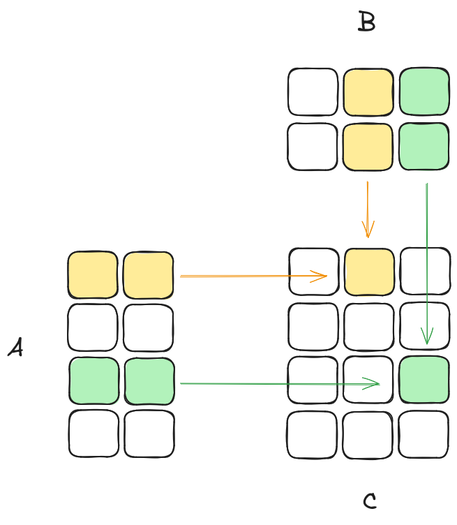
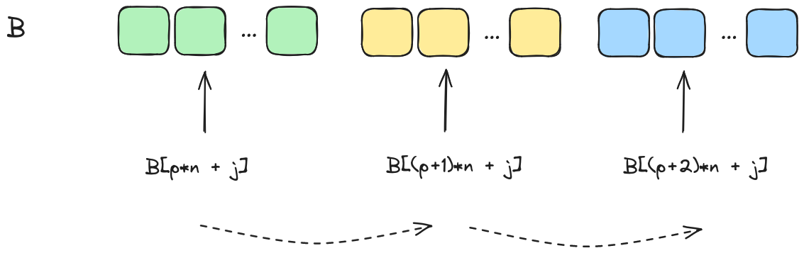

# Optimizing CPU Matrix Multiplication

## Content
<!-- toc -->

## Introduction
Matrix multiplication, denoted as **gemm** (general matrix multiplication), is a fundamental operation in linear algebra and forms the backbone of numerous scientific computing and machine learning applications.

Gemm computes the product of two matrices, with the resulting matrix being the linear combination of the rows of the first matrix and the columns of the second matrix. While conceptually simple, this operation is computationally intensive and often can be a performance bottleneck in many algorithms.

In this article, we will focus solely on the cubic time complexity version of gemm, avoiding advanced algorithms such as [Strassen's algorithm](https://en.wikipedia.org/wiki/Strassen_algorithm) or the [Coppersmith-Winograd](https://www-auth.cs.wisc.edu/lists/theory-reading/2009-December/pdfmN6UVeUiJ3.pdf) algorithm. The cubic gemm has a straightforward implementation with a time complexity of \\(O(n^3)\\).

<p align="center">
  
</p>

Let \\(A\\) be a \\(m \times k\\) matrix, \\(B\\) be a \\(k \times n\\) matrix, and \\(C\\) be the \\(m \times n\\) result matrix of their multiplication.

The element \\(C_{ij}\\) of the result matrix \\(C\\) is calculated as:

$$
C_{ij} = \sum_{p=1}^{k} A_{ip} \times B_{pj}
$$

## BLAS/OpenBLAS
[The Basic Linear Algebra Subprograms (BLAS)](https://www.netlib.org/blas/) is a standardized low-level application programming interface (API) that provides routines for common linear algebra operations such as vector and matrix operations. [OpenBLAS](https://www.openblas.net/) is a popular open-source implementation of the BLAS API that provides highly optimized routines for various architectures, including x86.

By comparing the performance of our hand-optimized gemm implementation against the highly optimized OpenBLAS gemm routine, we can gauge the effectiveness of our optimization efforts.

## Testing environment
Our benchmark testing environment is set up on a laptop powered by an AMD Ryzen 7 5800H CPU, which has 8 cores and 16 threads. The operating system is Linux, and we are using the GCC compiler with `-O2` level optimizations.

To account for potential variability due to factors such as background process load, we will record the average runtime across multiple runs (10), as a single run may not provide a representative measure.

## Naive gemm
We will start from a straightforward implementation of gemm and we will improve upon it step by step. 

All of our gemm routines assumes that matrix C is already initialized with zeros.

The following C code snippet demonstrates the naive implementation of matrix multiplication:
```C
void gemm_iter0(int m, int n, int k, double *A, double *B, double *C) {
  for (int i = 0; i < m; i++) {
    for (int j = 0; j < n; j++) {
      for (int p = 0; p < k; p++) {
        C[i * n + j] += A[i * k + p] * B[p * n + j];
      }
    }
  }
}
```
Let's compare its execution time with the OpenBLAS routine on square matrices:

| Matrix shape | openblas_gemm (ms) | gemm_iter0 (ms) |
| ------------ | ------------------ | --------------- |
| 512 x 512    | 1.3                | 345.1           |
| 1024 x 1024  | 10.8               | 5576.1          |


The run times of `gemm_iter0` seem way too high, in fact we are running into a terrible performance corner case.

When a program accesses memory, it doesn’t just fetch the specific byte it needs. Instead, it fetches a whole block of memory, known as a cache line, into the cache. If the program needs to access data that is not in the cache, it has to fetch a new cache line from memory, which is a slow operation.

Our matrices are stored in 1D memory in row-major order. This means that elements of each row of the matrix are contiguous in memory.

In the most inner loop while we access the elements of the \\(p^{th}\\) column of matrix \\(B\\), we are traversing non-contiguous memory locations. This will lead to inefficient cache utilization.

<p align="center">
  
</p>

Now, even worst when we have a matrix with dimensions that are some power of two, the whole cache line may only hold one row of matrix \\(B\\) which means that the program constantly has to fetch new cache lines from memory.

In fact when we increase the matrices sizes a little bit we get way better `gemm_iter0` run times:

| Matrix shape | openblas_gemm (ms) | gemm_iter0 (ms) |
| ------------ | ------------------ | --------------- |
| 544 x 544    | 1.6                | 141.5           |
| 1056 x 1056  | 8.8                | 1072.1          |


## Naive gemm improvements
### Loop interchange
We will simply interchange the j and p loops, to improve spatial locality and make better use of the CPU's cache:

```C
void gemm_iter1(int m, int n, int k, double *A, double *B, double *C) {
  for (int i = 0; i < m; i++) {
    for (int p = 0; p < k; p++) {
      for (int j = 0; j < n; j++) {
        C[i * n + j] += A[i * k + p] * B[p * n + j];
      }
    }
  }
}
```
Interchanging the j and p loops improves spatial locality because the elements of matrix B are now accessed in a contiguous manner within the innermost loop.

Let's evaluate the performance improvement:

| Matrix shape | openblas_gemm (ms) | gemm_iter0 (ms) | gemm_iter1 (ms) |
| ------------ | ------------------ | --------------- | --------------- |
| 544 x 544    | 1.6                | 141.5           | 57.9            |
| 1056 x 1056  | 8.8                | 1072.1          | 439.2           |


This small change of interchanging the j and p loops results in an impressive gain in performance compared to `gemm_iter0`. 

### Single Instruction Multiple Data
[SIMD (Single Instruction, Multiple Data)](https://en.wikipedia.org/wiki/Single_instruction,_multiple_data) is a class of parallel computing instructions that allows a single instruction to operate on multiple data elements simultaneously. This technique takes advantage of the CPU's vector registers and vector processing capabilities, enabling data-level parallelism.

[AVX (Advanced Vector Extensions)](https://en.wikipedia.org/wiki/Advanced_Vector_Extensions) is a set of SIMD instructions introduced by Intel in 2011, providing support for wider vector registers and a richer set of vector operations. AVX2, introduced in 2013, further extended the AVX instruction set, enabling operations on 256-bit wide vectors for both integer and floating-point data types.

The innermost loop will be modified to operate on 4 elements of matrix B at a time, using AVX2 intrinsics:

```C
void gemm_iter2(int m, int n, int k, double *A, double *B, double *C) {
  for (int i = 0; i < m; i++) {
    for (int p = 0; p < k; p++) {
      __m256d A_val = _mm256_set1_pd(A[i * k + p]);
      for (int j = 0; j < n; j += 4) {
        __m256d B_vec = _mm256_loadu_pd(&B[p * n + j]);
        __m256d C_vec = _mm256_loadu_pd(&C[i * n + j]);
        C_vec = _mm256_fmadd_pd(A_val, B_vec, C_vec);
        _mm256_storeu_pd(&C[i * n + j], C_vec);
      }
      // Handle remaining elements (if any) in a scalar manner
      for (int j = n - (n % 4); j < n; j++) {
        C[i * n + j] += A[i * k + p] * B[p * n + j];
      }
    }
  }
}
```

* `__m256d A_val = _mm256_set1_pd(A[i * k + p])`: This line broadcasts the value of `A[i * k + p]` to all 4 elements of the `A_val` vector.
* `__m256d B_vec = _mm256_loadu_pd(&B[p * n + j])`: This line loads 4 consecutive elements of matrix `B` into the `B_vec` vector, starting from the memory address `&B[p * n + j]`.
* `__m256d C_vec = _mm256_loadu_pd(&C[i * n + j])`: This line loads 4 consecutive elements of matrix `C` into the `C_vec` vector, starting from the memory address `&C[i * n + j]`.
* `C_vec = _mm256_fmadd_pd(A_val, B_vec, C_vec)`: This line performs a fused multiply-add operation, where each element of `A_val` is multiplied by the corresponding element of `B_vec`, and the results are added to the corresponding elements of `C_vec`.
* `_mm256_storeu_pd(&C[i * n + j], C_vec)`: This line stores the 4 elements of the `C_vec` vector back to memory, starting from the address `&C[i * n + j]`.

For more information about Intrinsics please refer to the [Intel® Intrinsics Guide](https://www.intel.com/content/www/us/en/docs/intrinsics-guide/index.html#).

Let's evaluate the performance improvement:

| Matrix shape | openblas_gemm (ms) | gemm_iter1 (ms) | gemm_iter2 (ms) |
| ------------ | ------------------ | --------------- | --------------- |
| 544 x 544    | 1.6                | 57.9            |  16.6           |
| 1056 x 1056  | 8.8                | 439.2           |  139.7          |

We can indeed notice a **4x** improvement.

### OpenMP Parallelization
[OpenMP (Open Multi-Processing)](https://www.openmp.org/) is an API that supports multi-platform shared memory multiprocessing programming in C, C++, and Fortran.

In our case, we can parallelize the outer loop of the matrix multiplication algorithm using OpenMP directives to distribute the workload across multiple threads.

```C
void gemm_iter3(int m, int n, int k, double *A, double *B, double *C) {
#pragma omp parallel for schedule(dynamic)
  for (int i = 0; i < m; i++) {
    for (int p = 0; p < k; p++) {
      __m256d A_val = _mm256_set1_pd(A[i * k + p]);
      for (int j = 0; j < n; j += 4) {
        __m256d B_vec = _mm256_loadu_pd(&B[p * n + j]);
        __m256d C_vec = _mm256_loadu_pd(&C[i * n + j]);
        C_vec = _mm256_fmadd_pd(A_val, B_vec, C_vec);
        _mm256_storeu_pd(&C[i * n + j], C_vec);
      }
      // Handle remaining elements (if any) in a scalar manner
      for (int j = n - (n % 4); j < n; j++) {
        C[i * n + j] += A[i * k + p] * B[p * n + j];
      }
    }
  }
}
```

The outer loop `(for (int i = 0; i < m; i++))` is parallelized using OpenMP's `#pragma omp parallel for`. The `schedule(dynamic)` clause dynamically distributes loop iterations among the available threads to balance the workload evenly.

| Matrix shape | openblas_gemm (ms) | gemm_iter2 (ms) | gemm_iter3 (ms) |
| ------------ | ------------------ | --------------- | --------------- |
| 544 x 544    |  1.3               |   20.4          |    4.9          |
| 1056 x 1056  |  11.0              |   147.7         |    25.9         |

So far we went from 141.5/1072.1 ms of the naive gemm_iter0 to 4.9/25.9 of the gemm_iter3, about a **29x/41x improvement**. However, OpenBLAS is still beating us with runtimes of 1.6/8.8 ms for the same matrix sizes.

## Conclusion
This article highlights that even with small, incremental changes, significant performance gains can be achieved. Simple optimizations, such as better loop ordering, efficient use of memory, and leveraging cache locality, can dramatically reduce computation times.

Despite these substantial gains, our optimized implementation still lags behind highly optimized libraries like OpenBLAS.  This underscores the sophistication and efficiency of professionally developed libraries that leverage advanced optimizations, hardware-specific enhancements, and extensive fine-tuning.
